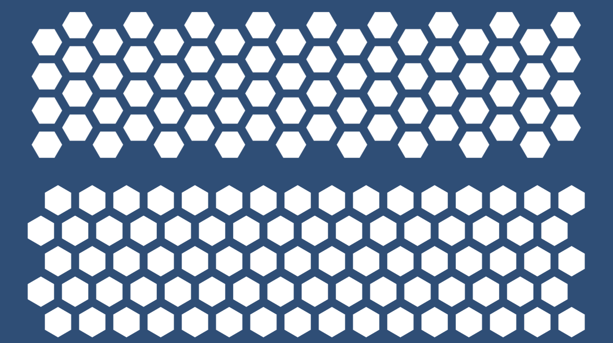

# HexagonalUI

## Purpose

Unity currently does not offer a built-in layout group for creating stackings of hexagonal elements, such as those sometimes used for skill grids. This package aims to fill that gap by providing a hexagonal layout group that will page UI elements into a grid.

## Installation

To add the package to a project, select `Window > Package Manager` in Unity.

Under the `+` sign, select `Add package from git URL...`.

Paste `https://github.com/mpewsey/HexagonalUI.git` into the text field, and click `Add`.

## Usage

To use, simply attach the `HexLayoutGroup` component to a Game Object, as you would with Unity's built-in layout group components. The cell orientation component setting is based on the direction of the hexagonal element's long diagonal. In the image above, the hexagons on the top feature a horizontal cell orientation, whereas the hexagons on the bottom feature a vertical orientation.

Due to the staggering of the hexagonal elements, the default `Button` component input navigation tends to navigate randomly. Therefore, if buttons will serve as the children of the layout group, it is recommended that the `HexButton` component, which provides more regular navigation behaviour, be used instead.

## Tile Art Creation Guidance

To match the dimensions assigned by the hexagonal layout group, it is recommended that hexagonal tile art have their long diagonals to short diagonals proportioned to 1 : 0.86602540378. For instance, the example tile images in this package are 100 px by 87 px, including the required rounding to the nearest pixel.
